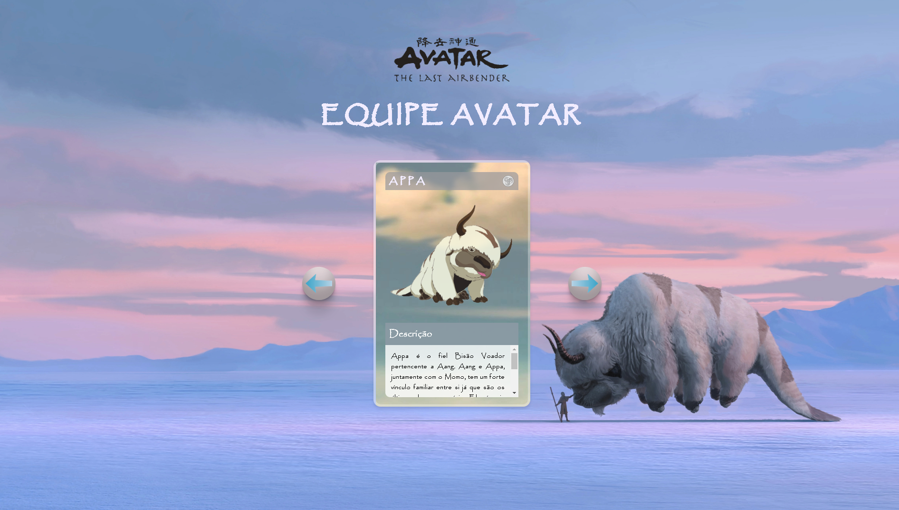
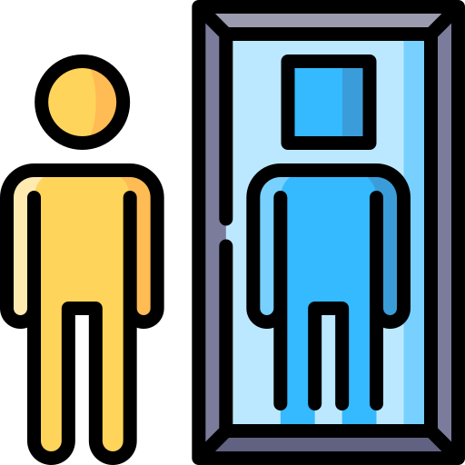

  
  <h1>X-AVATAR - Equipe Avatar</h1>

Este projeto é uma página web interativa que apresenta os personagens principais da série "Avatar: A Lenda de Aang". A página possui um carrossel de personagens que permite aos usuários navegar entre diferentes cartas, cada uma contendo a descrição e a imagem de um personagem.

## Funcionalidades

### Navegação por Botões

**Navegação por Botões:** Botão "Next" para avançar para o próximo personagem. Botão "Back" para voltar ao personagem anterior.

### Animação Suave

**Animação Suave:** Transições suaves ao mudar de uma carta para outra.

### Descrição Detalhada

**Descrição Detalhada:** Cada carta contém uma descrição detalhada do personagem, incluindo a imagem e os elementos associados.

## Como Usar

1. **Navegue pelo Carrossel:** Utilize os botões de seta para avançar ou retroceder entre as cartas dos personagens.
2. **Visualize as Descrições:** Leia a descrição detalhada de cada personagem para conhecer mais sobre a história e as habilidades de cada um.

## Estrutura do Projeto

O projeto é composto por três principais componentes: 
Para a estruturação do conteúdo. 
Para a estilização da página e criação de um layout responsivo. 
Para adicionar interatividade ao carrossel de personagens. 

### HTML

O arquivo HTML define a estrutura básica da página, incluindo:

- Cabeçalho com o logo e o título.
- Carrossel de personagens com botões para navegar entre as cartas.
- Descrições detalhadas dos personagens.

### CSS

O CSS é dividido em três arquivos:

- **reset.css:** Remove estilos padrões dos navegadores para garantir consistência.
- **style.css:** Define a estilização principal da página, incluindo fontes, cores, tamanhos e layout.
- **responsive.css:** Adapta o layout para diferentes tamanhos de tela, garantindo que a página seja responsiva.

### JavaScript

O JavaScript controla a funcionalidade do carrossel, permitindo que os usuários naveguem entre as cartas dos personagens. Os principais elementos incluem:

- Seleção de cartas.
- Navegação entre cartas utilizando os botões "next" e "back".
- Animações suaves para transições entre cartas.

## Nota

**Nota:** Este projeto é uma homenagem à série "Avatar: A Lenda de Aang" e é utilizado apenas para fins educacionais e de entretenimento. Todos os direitos sobre os personagens e imagens pertencem aos seus respectivos criadores e distribuidores.

